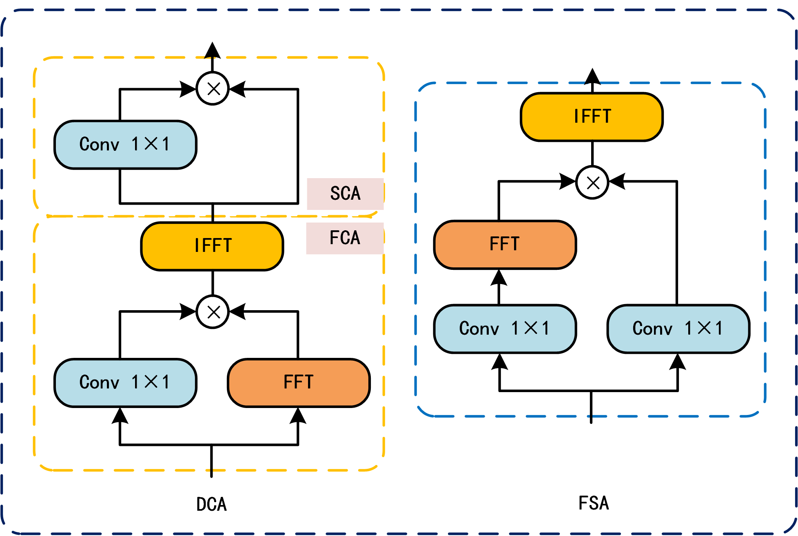
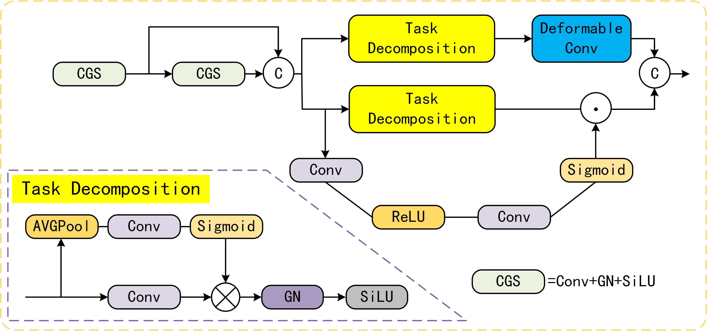

# Dual-Domain Feature-Guided Task Alignment for Enhanced Small Object Detection

This repository contains the code for the paper **"Dual-Domain Feature-Guided Task Alignment for Enhanced Small Object Detection"**. The proposed method includes a Small Object Enhancement Pyramid (SOEP) and Task-Aligned Head (TAH) for improved detection of small objects, particularly in UAV images. The repository includes the implementation of the model, experiments, and evaluation metrics.

(1).png)
**Fig.1. Overall framework of D2FTA with Small Object Enhancement Pyramid(SOEP) and Task Aligned Head(TAH).**

## Table of Contents
- [Introduction](#introduction)
- [Requirements](#requirements)
- [Installation](#installation)
- [Usage](#usage)
- [Model Architecture](#model-architecture)
- [Experiments](#experiments)
- [Results](#results)

## Introduction

Small object detection is a challenge in images captured from UAVs, due to limited pixel resolution and frequent pooling in deep learning models. This project addresses these challenges with:
- **SOEP (Small Object Enhancement Pyramid)**: Enhances small object feature representation using frequency domain analysis.
- **TAH (Task-Aligned Head)**: Unifies classification and localization tasks to improve small object detection.

## Requirements

To run the code, you will need the following dependencies:

You can install the dependencies using requirements.txt:

pip install -r requirements.txt

### Installation
Clone the repository:

```bash
git clone https://github.com/RichardGuo0301/Dual-Domain-FTA.git
```
```bash
cd your-repo
```

Install the dependencies:

```bash
pip install -r requirements.txt
```

## Usage

### Training:

To train the model on the VisDrone dataset:

```bash
python train.py --dataset VisDrone --epochs 150
```
### Evaluation:

To evaluate the model on the test dataset:

```bash
python evaluate.py --dataset VisDrone --weights checkpoints/best_model.pth
```

## Model Architecture
The proposed architecture is built on the YOLOv8 framework, featuring:


**Fig. 2. Illustration of DCA and FSA in SOEP**



**Fig. 3.  Illustration of our proposed TAH**

- **SOEP**: Extracts high-frequency features using spectral analysis.
- **TAH**: Combines classification and localization tasks to improve alignment.
Refer to the diagram in the paper for a detailed view of the architecture.

## Experiments
Our experiments are conducted on the VisDrone dataset. The dataset consists of images from UAVs, and the models are trained and evaluated for small object detection. You can download the dataset from VisDrone Dataset.

### The default training settings:

- **Input image size**: 640x640
- **Batch size**: 4
- **Optimizer**: SGD with an initial learning rate of 0.01
- **Epochs**: 150

## Results
The model outperforms previous state-of-the-art models with an improvement of 12.7% in mAP@0.5 and 14.19% in mAP@0.5:0.95 on the VisDrone dataset.

| Model                           | Input Shape | GFlops ↓ | Params ↓ | mAP@0.5:0.95 ↑ | mAP@0.5 ↑ |
|----------------------------------|-------------|----------|----------|----------------|-----------|
| Faster-RCNN-R50-FPN-CIOU         | (768, 1344) | 208G     | 41.39M   | 0.194          | 0.329     |
| Cascade-RCNN-R50-FPN             | (768, 1344) | 236G     | 69.29M   | 0.197          | 0.326     |
| TOOD-R50                         | (768, 1344) | 199G     | 32.04M   | 0.204          | 0.339     |
| DINO                             | (750, 1333) | 274G     | 47.56M   | 0.253          | 0.445     |
| YOLOv8-QSD                       | (640, 640)  | 7.3G     | 2.072M   | 0.168          | 0.346     |
| YOLOX-Tiny                       | (640, 640)  | 7.578G   | 5.035M   | 0.148          | 0.278     |
| LD-YOLOv10                       | (640, 640)  | 23.7G    | 3.04M    | 0.235          | 0.394     |
| RT-DETR                          | (640, 640)  | 85.1G    | 32.68M   | 0.253          | 0.422     |
| LWUAVDet                         | (640, 640)  | 19.2G    | 5.2M     | 0.247          | 0.414     |
| LUDY-S                           | (640, 640)  | -        | 10.34M   | -              | 0.417     |
| **Ours (D2FTA)**                 | (640, 640)  | 46.7G    | 9.97M    | **0.259**      | **0.428** |

